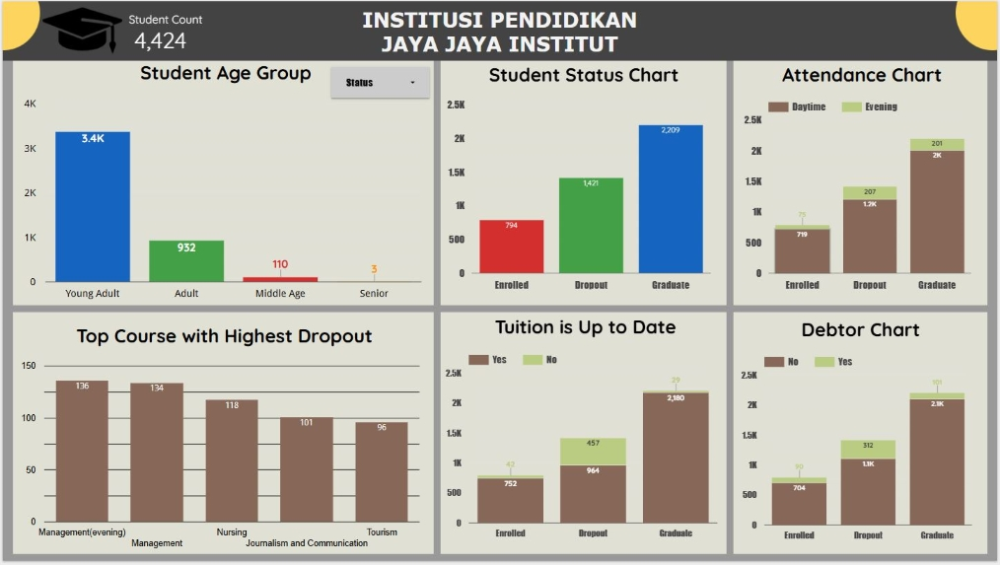
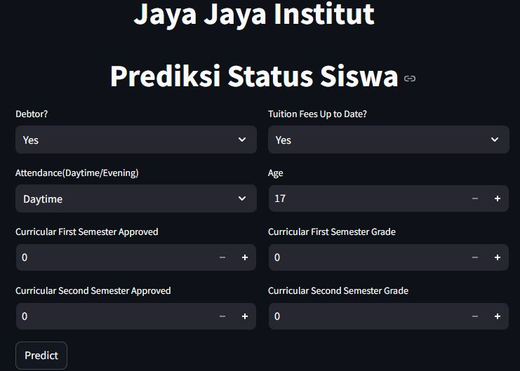

# Proyek Akhir: Menyelesaikan Permasalahan Perusahaan Edutech

## Business Understanding

Institusi Jaya Jaya Institut menghadapi masalah tingginya angka _dropout_ siswa. Oleh karena ini, institusi pendidikan tersebut ingin mencari solusi untuk mengurangi tingginya angka _dropout_ dengan memberikan bimbingan khusus bagi siswa yang berpotensi _dropout_. Untuk melakukan ini, maka diperlukan analisis dan membuat sebuah model _Machine Learning_ untuk menyelesaikan masalah tersebut.

### Permasalahan Bisnis

Apa yang perlu dilakukan untuk mengurangi tingginya angka _dropout_ pada Jaya Jaya Institut?

### Cakupan Proyek

Cakupan proyek adalah sebagai berikut:
* membuat dashboard untuk visualisasi hasil analisis
* membuat model ML untuk memprediksi siswa berpotensi dropout

### Persiapan

**Sumber data**: [Predict Students' Dropout and Academic Success](https://archive.ics.uci.edu/dataset/697/predict+students+dropout+and+academic+success)

Dataset memiliki kolom sebanyak 35 dan 4.424 baris, dengan deksripsi sebagai berikut:  
    
| Column name | Description |  
| --- | --- |  
|Marital status | The marital status of the student. (Categorical) 1 – single 2 – married 3 – widower 4 – divorced 5 – facto union 6 – legally separated |
| Application mode | The method of application used by the student. (Categorical) 1 - 1st phase - general contingent 2 - Ordinance No. 612/93 5 - 1st phase - special contingent (Azores Island) 7 - Holders of other higher courses 10 - Ordinance No. 854-B/99 15 - International student (bachelor) 16 - 1st phase - special contingent (Madeira Island) 17 - 2nd phase - general contingent 18 - 3rd phase - general contingent 26 - Ordinance No. 533-A/99, item b2) (Different Plan) 27 - Ordinance No. 533-A/99, item b3 (Other Institution) 39 - Over 23 years old 42 - Transfer 43 - Change of course 44 - Technological specialization diploma holders 51 - Change of institution/course 53 - Short cycle diploma holders 57 - Change of institution/course (International)|
|Application order | The order in which the student applied. (Numerical) Application order (between 0 - first choice; and 9 last choice) |
|Course | The course taken by the student. (Categorical) 33 - Biofuel Production Technologies 171 - Animation and Multimedia Design 8014 - Social Service (evening attendance) 9003 - Agronomy 9070 - Communication Design 9085 - Veterinary Nursing 9119 - Informatics Engineering 9130 - Equinculture 9147 - Management 9238 - Social Service 9254 - Tourism 9500 - Nursing 9556 - Oral Hygiene 9670 - Advertising and Marketing Management 9773 - Journalism and Communication 9853 - Basic Education 9991 - Management (evening attendance)|
|Daytime/evening attendance | Whether the student attends classes during the day or in the evening. (Categorical) 1 – daytime 0 - evening |
|Previous qualification| The qualification obtained by the student before enrolling in higher education. (Categorical) 1 - Secondary education 2 - Higher education - bachelor's degree 3 - Higher education - degree 4 - Higher education - master's 5 - Higher education - doctorate 6 - Frequency of higher education 9 - 12th year of schooling - not completed 10 - 11th year of schooling - not completed 12 - Other - 11th year of schooling 14 - 10th year of schooling 15 - 10th year of schooling - not completed 19 - Basic education 3rd cycle (9th/10th/11th year) or equiv. 38 - Basic education 2nd cycle (6th/7th/8th year) or equiv. 39 - Technological specialization course 40 - Higher education - degree (1st cycle) 42 - Professional higher technical course 43 - Higher education - master (2nd cycle) |
|Previous qualification (grade) | Grade of previous qualification (between 0 and 200) |
| Nacionality | The nationality of the student. (Categorical) 1 - Portuguese; 2 - German; 6 - Spanish; 11 - Italian; 13 - Dutch; 14 - English; 17 - Lithuanian; 21 - Angolan; 22 - Cape Verdean; 24 - Guinean; 25 - Mozambican; 26 - Santomean; 32 - Turkish; 41 - Brazilian; 62 - Romanian; 100 - Moldova (Republic of); 101 - Mexican; 103 - Ukrainian; 105 - Russian; 108 - Cuban; 109 - Colombian|
|Mother's qualification | The qualification of the student's mother. (Categorical) 1 - Secondary Education - 12th Year of Schooling or Eq. 2 - Higher Education - Bachelor's Degree 3 - Higher Education - Degree 4 - Higher Education - Master's 5 - Higher Education - Doctorate 6 - Frequency of Higher Education 9 - 12th Year of Schooling - Not Completed 10 - 11th Year of Schooling - Not Completed 11 - 7th Year (Old) 12 - Other - 11th Year of Schooling 14 - 10th Year of Schooling 18 - General commerce course 19 - Basic Education 3rd Cycle (9th/10th/11th Year) or Equiv. 22 - Technical-professional course 26 - 7th year of schooling 27 - 2nd cycle of the general high school course 29 - 9th Year of Schooling - Not Completed 30 - 8th year of schooling 34 - Unknown 35 - Can't read or write 36 - Can read without having a 4th year of schooling 37 - Basic education 1st cycle (4th/5th year) or equiv. 38 - Basic Education 2nd Cycle (6th/7th/8th Year) or Equiv. 39 - Technological specialization course 40 - Higher education - degree (1st cycle) 41 - Specialized higher studies course 42 - Professional higher technical course 43 - Higher Education - Master (2nd cycle) 44 - Higher Education - Doctorate (3rd cycle)|
|Father's qualification | The qualification of the student's father. (Categorical) 1 - Secondary Education - 12th Year of Schooling or Eq. 2 - Higher Education - Bachelor's Degree 3 - Higher Education - Degree 4 - Higher Education - Master's 5 - Higher Education - Doctorate 6 - Frequency of Higher Education 9 - 12th Year of Schooling - Not Completed 10 - 11th Year of Schooling - Not Completed 11 - 7th Year (Old) 12 - Other - 11th Year of Schooling 13 - 2nd year complementary high school course 14 - 10th Year of Schooling 18 - General commerce course 19 - Basic Education 3rd Cycle (9th/10th/11th Year) or Equiv. 20 - Complementary High School Course 22 - Technical-professional course 25 - Complementary High School Course - not concluded 26 - 7th year of schooling 27 - 2nd cycle of the general high school course 29 - 9th Year of Schooling - Not Completed 30 - 8th year of schooling 31 - General Course of Administration and Commerce 33 - Supplementary Accounting and Administration 34 - Unknown 35 - Can't read or write 36 - Can read without having a 4th year of schooling 37 - Basic education 1st cycle (4th/5th year) or equiv. 38 - Basic Education 2nd Cycle (6th/7th/8th Year) or Equiv. 39 - Technological specialization course 40 - Higher education - degree (1st cycle) 41 - Specialized higher studies course 42 - Professional higher technical course 43 - Higher Education - Master (2nd cycle) 44 - Higher Education - Doctorate (3rd cycle) |
| Mother's occupation | The occupation of the student's mother. (Categorical) 0 - Student 1 - Representatives of the Legislative Power and Executive Bodies, Directors, Directors and Executive Managers 2 - Specialists in Intellectual and Scientific Activities 3 - Intermediate Level Technicians and Professions 4 - Administrative staff 5 - Personal Services, Security and Safety Workers and Sellers 6 - Farmers and Skilled Workers in Agriculture, Fisheries and Forestry 7 - Skilled Workers in Industry, Construction and Craftsmen 8 - Installation and Machine Operators and Assembly Workers 9 - Unskilled Workers 10 - Armed Forces Professions 90 - Other Situation 99 - (blank) 122 - Health professionals 123 - teachers 125 - Specialists in information and communication technologies (ICT) 131 - Intermediate level science and engineering technicians and professions 132 - Technicians and professionals, of intermediate level of health 134 - Intermediate level technicians from legal, social, sports, cultural and similar services 141 - Office workers, secretaries in general and data processing operators 143 - Data, accounting, statistical, financial services and registry-related operators 144 - Other administrative support staff 151 - personal service workers 152 - sellers 153 - Personal care workers and the like 171 - Skilled construction workers and the like, except electricians 173 - Skilled workers in printing, precision instrument manufacturing, jewelers, artisans and the like 175 - Workers in food processing, woodworking, clothing and other industries and crafts 191 - cleaning workers 192 - Unskilled workers in agriculture, animal production, fisheries and forestry 193 - Unskilled workers in extractive industry, construction, manufacturing and transport 194 - Meal preparation assistants |
| Father's occupation | The occupation of the student's father. (Categorical) 0 - Student 1 - Representatives of the Legislative Power and Executive Bodies, Directors, Directors and Executive Managers 2 - Specialists in Intellectual and Scientific Activities 3 - Intermediate Level Technicians and Professions 4 - Administrative staff 5 - Personal Services, Security and Safety Workers and Sellers 6 - Farmers and Skilled Workers in Agriculture, Fisheries and Forestry 7 - Skilled Workers in Industry, Construction and Craftsmen 8 - Installation and Machine Operators and Assembly Workers 9 - Unskilled Workers 10 - Armed Forces Professions 90 - Other Situation 99 - (blank) 101 - Armed Forces Officers 102 - Armed Forces Sergeants 103 - Other Armed Forces personnel 112 - Directors of administrative and commercial services 114 - Hotel, catering, trade and other services directors 121 - Specialists in the physical sciences, mathematics, engineering and related techniques 122 - Health professionals 123 - teachers 124 - Specialists in finance, accounting, administrative organization, public and commercial relations 131 - Intermediate level science and engineering technicians and professions 132 - Technicians and professionals, of intermediate level of health 134 - Intermediate level technicians from legal, social, sports, cultural and similar services 135 - Information and communication technology technicians 141 - Office workers, secretaries in general and data processing operators 143 - Data, accounting, statistical, financial services and registry-related operators 144 - Other administrative support staff 151 - personal service workers 152 - sellers 153 - Personal care workers and the like 154 - Protection and security services personnel 161 - Market-oriented farmers and skilled agricultural and animal production workers 163 - Farmers, livestock keepers, fishermen, hunters and gatherers, subsistence 171 - Skilled construction workers and the like, except electricians 172 - Skilled workers in metallurgy, metalworking and similar 174 - Skilled workers in electricity and electronics 175 - Workers in food processing, woodworking, clothing and other industries and crafts 181 - Fixed plant and machine operators 182 - assembly workers 183 - Vehicle drivers and mobile equipment operators 192 - Unskilled workers in agriculture, animal production, fisheries and forestry 193 - Unskilled workers in extractive industry, construction, manufacturing and transport 194 - Meal preparation assistants 195 - Street vendors (except food) and street service providers |
| Admission grade | Admission grade (between 0 and 200) |
| Displaced | Whether the student is a displaced person. (Categorical) 	1 – yes 0 – no |
| Educational special needs | Whether the student has any special educational needs. (Categorical) 1 – yes 0 – no |
|Debtor | Whether the student is a debtor. (Categorical) 1 – yes 0 – no|
|Tuition fees up to date | Whether the student's tuition fees are up to date. (Categorical) 1 – yes 0 – no|
|Gender | The gender of the student. (Categorical) 1 – male 0 – female |
|Scholarship holder | Whether the student is a scholarship holder. (Categorical) 1 – yes 0 – no |
|Age at enrollment | The age of the student at the time of enrollment. (Numerical)|
|International | Whether the student is an international student. (Categorical) 1 – yes 0 – no|
|Curricular units 1st sem (credited) | The number of curricular units credited by the student in the first semester. (Numerical) |
| Curricular units 1st sem (enrolled) | The number of curricular units enrolled by the student in the first semester. (Numerical) |
| Curricular units 1st sem (evaluations) | The number of curricular units evaluated by the student in the first semester. (Numerical) 
| Curricular units 1st sem (approved) | The number of curricular units approved by the student in the first semester. (Numerical) |
| Curricular units 1st sem (grade) |  Grade average in the 1st semester (between 0 and 20) (Numerical|
| Curricular units 1st sem (without evaluations) | Number of curricular units without evalutions in the 1st semester (Numerical)|
| Curricular units 2nd sem (credited) | Number of curricular units credited in the 2nd semester (Numerical)|		
| Curricular units 2nd sem (enrolled) | Number of curricular units enrolled in the 2nd semester (Numerical)|		
| Curricular units 2nd sem (evaluations) | Number of evaluations to curricular units in the 2nd semester (Numerical) |
| Curricular units 2nd sem (approved) | Number of curricular units approved in the 2nd semester (Numerical)	|	
| Curricular units 2nd sem (grade) | Grade average in the 2nd semester (between 0 and 20) (Numerical) |	
| Curricular units 2nd sem (without evaluations) | Number of curricular units without evalutions in the 1st semester (Numerical)|		
| Unemployment rate | Unemployment rate (%) (Numerical)|		
| Inflation rate | Inflation rate (%)(Numerical) |		
| GDP	| GDP (Numerical)|		
| Target | Target. The problem is formulated as a three category classification task (dropout, enrolled, and graduate) at the end of the normal duration of the course(Categorical) |		


**Setup environment**:  
* library yang digunakan untuk analisis data:
```
import pandas as pd
import matplotlib.pyplot as plt
import seaborn as sns
import numpy as np
from sklearn.ensemble import RandomForestClassifier
from sklearn.preprocessing import MinMaxScaler, StandardScaler
from sklearn.preprocessing import LabelEncoder
from sklearn.model_selection import train_test_split
from sklearn.metrics import confusion_matrix, accuracy_score, classification_report
from skopt import BayesSearchCV
from imblearn.over_sampling import SMOTE
from collections import Counter
import warnings
warnings.simplefilter(action='ignore', category=FutureWarning)

import sklearn
import joblib
import os
import time

```
* library yang digunakan untuk membuat prototype dengan Streamlit:
```
import streamlit as st
import gdown
import joblib
import numpy as np
```
Untuk menggunakan library yang sudah tersedia pada requirements.txt, diperlukan sebuah virtual environment yang dapat dibuat melalui command prompt(cmd)/PowerShell/VS Code(Terminal). Berikut adalah tahapannya :

1. Buka command prompt(cmd)/PowerShell/terminal VS Code
2. Gunakan perintah

```
cd x:\lokasi pembuatan venv/proyek
```

3. Membuat environment

```
#untuk venv_name bisa diganti sesuka hati
python -m venv venv_name
```

4. Mengaktifkan environment
* cmd/Terminal

```
venv\Scripts\activate
```

* PowerShell

```
.\venv\Scripts\Activate.ps1
```

Jika virtual environment sudah dibuat kemudian menggunakan perintah berikut untuk _install_ **requirements.txt*.

```
pip install -r requirements.txt
```


## Business Dashboard

**Link Dashboard** : [LookerStudio-Dashboard](https://lookerstudio.google.com/u/0/reporting/58a695dc-e1ba-4321-af0b-32f63dc25283/page/IrfcE)  
    

Dashboard ini dibuat dengan menggunakan **Looker Studio**. Grafik-grafik yang terdapat pada dashboard memiliki informasi seperti:
1. Jumlah siswa. 
2. Grafik kelompok umur siswa yang diatur dengan sebuah _drop-down list_.
3. Top Course dengan jumlah _dropout_ tertinggi.
4. Grafik status siswa, memiliki informasi berapa banyak siswa yang berstatus, _Dropout_,_Graduated_, atau _Enrolled_.
5. Grafik Tuition, memiliki informasi berupa siswa yang melakukkan pembayaran tepat waktu atau tidak, berdasarkan status siswa. 
6. Grafik Attendance, memiliki informasi siswa yang mengikuti jadwal pembelajaran pada waktu _daytime_ atau _evening_ berdasarkan status siswa. Dari grafik ini, didapatkan hasil analisis bahwa pada waktu daytime terdapat banyak siswa yang dropout. 
7. Grafik Debtor, memiliki informasi siswa yang memiliki hutang atau tidak berdasarkan status siswa.

## Menjalankan Sistem Machine Learning

**Link Prototype** : [Streamlit-ichsan-jayamaju.streamlit](https://ichsan-jayatech.streamlit.app/) 

Untuk menjalankan prototype secara lokal, dapat melakukan sebagai berikut:
* membuka cmd prompt atau powershell kemudian mengetik.
```
cd x:\ichsan-proyek_edutech
```
disesuaikan dengan lokasi atau dir, dimana file python berada.  
* setelah itu menggunakan perintah ini untuk menjalankan streamlit.
```
streamlit run prototype.py
```

Selain menjalankan secara lokal, bisa menggunakan link yang sudah disediakan. Jika sudah menjalankan maka akan muncul tampilan sebagai berikut:  
  
Terdapat input:
1. Debtor, yang berisikan opsi, **Yes** atau **No**
2. Tuition Fees Up to Date, yang berisikan opsi, **Yes** atau **No**
3. Attendance, yang berisikan opsi, **Daytime** atau **Evening**
4. Age
5. Curricular First Semester Approved
6. Curricular First Semester Grade
7. Curricular Second Semester Approved
8. Curricular Second Semester Grade
9. Tombol **Predict** untuk mengeluarkan hasil prediksi, **Graduated**, **Dropout**, atau **Enrolled**, berdasarkan input diatas.

## Conclusion

Dari analisis yang sudah dilakukan, didapatkan hasil sebagai berikut:
1. Jaya Jaya Institut memiliki sebanyak **1.421** siswa yang _dropout_.
2. Terdapat **5 course** yang memiliki angka _dropout_ yang tinggi yaitu, **Management(evening), **Management**, **Nursing**, **Journalism and Communication**, dan **Tourism**.
3. Pada Jaya Jaya Institut terdapat banyak siswa didalam kelompok umur **Young Adult**. Dengan jumlah sebanyak itu sudah tentunya pada kelompok tersebut ditemukan banyaknya siswa yang _dropout_. Namun pada grup **Adult** dan **Middle Age**, terdapat lebih dari **50%** siswa yang memiliki status _dropout_.
4. Ditemukan sebanyak **457** siswa yang _dropout_ tidak melakukan pembayaran secara tepat waktu.
5. Terdapat **1.214** siswa yang mengikuti kelas pada waktu _daytime_ adalah _dropout_. Dan untuk waktu _evening_ sebanyak **207** siswa.
6. Terdapat **312** siswa yang _dropout_ memiliki hutang.

### Rekomendasi Action Items (Optional)

Dengan menggunakan informasi yang didapatkan, hal-hal yang dapat dilakukan oleh Jaya Jaya Institut adalah sebagai berikut:
* **Memfokuskan pada kelas-kelas yang memiliki angka _dropout_ tinggi.**  
Seperti diketahui terdapat **5** kelas memiliki angka _dropout_ tinggi. Maka institut mencari apa terjadi pada kelima kelas tersebut. Seperti, apakah siswa memiliki kesulitan pada kelas tersebut? apakah siswa memiliki masalah dengan kurikulum yang terdapat dikelas tersebut? dan lain-lain. 

* **Kelompok Umur Siswa.**  
Walau terdapat banyak siswa yang melakukan _dropout_ berada pada kelompok **Young Adult**, namun persetansenya tidak setinggi dengan kelompok **Adult** dan **Middle Age**. Maka institut dapat memfokuskan bimbingan untuk kelompok **Adult** dan **Middle Age**. Selain itu mencari apa yang menjadi masalah mereka, seperti kesibukkan selain belajar, kesulitan keuanggan, tidak dapat membagi waktu, jadwal kelas, dan lain-lain. 
  
* **Jadwal Kelas.**  
Dengan melihat tingginya angka _dropout_ pada jadwal _daytime_, maka institut dapat memfokuskan peningkatkan kualitas kelas pada waktu tersebut. Membuat _questionnaire_ agar institut tentunya dapat membuat jadwal-jadwal yang cocok untuk siswa-siswa yang mengikuti kelas pada jadwal tersebut. Untuk jadwal pada waktu _evening_, dapat diduga bahwa pada waktu ini digunakan oleh siswa-siswa yang kemungkinan bekerja waktu pagi hingga sore. Maka institut dapat memberikan materi pembelajaran yang tepat dan efektif untuk siswa. Agar mereka dapat belajar secara efektif hingga lulus dari kelas yang siswa ambil.

* **Opsi Pembayaran dan Pinjaman(Student Loan).**  
Dengan menyediakan opsi pembayaran, siswa dapat menyesuaikan dengan kondisi keuanggan yang siswa miliki. Maka siswa tidak perlu khawatir dengan pembayaran telat hingga menghambat pembelajaran siswa di insitusi. Atau dengan menyediakan _student loan_ untuk membantu siswa yang memiliki kesulitan kuanggan. Namun dengan adanya _student loan_, institusi perlu menyediakan _student loan_ yang tidak memberatkan siswa. Karena, banyak siswa yang mengambil _student loan_ justru menjadi beban bagi siswa. Oleh karena itu, institusi perlu memastikan bahwa siswa memang perlu atau cocok untuk menerima _student loan_.

